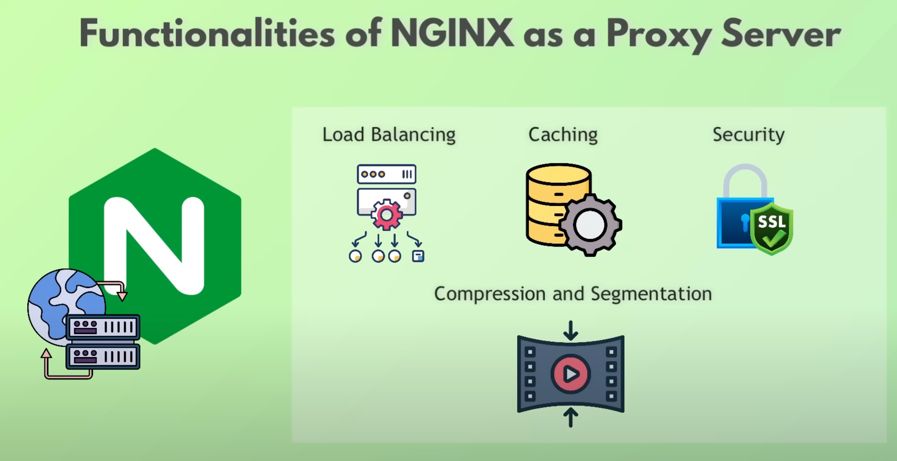

# Nginx

- The basic web model is teh client-server model.
- Even today when a client machine requests a resource, a server machine has to use a software to identify where the resource is stored and send it back.
- This server software for majority of the websites is **Nginx**
    - **Nginx** is a high performace server software, a piece of software which handles HTTP requests on the server machine.
    - **Nginx** is also a proxy server. Being a proxy server it comes with many functionality. Some of the most popular uses is:
        - a **load balancer**: It can proxy the requests into multiple backend systems to balance the incoming load and improve performance
        - **Caching**: is a core feature of Nginx. It cache resp from backend server for freq accessed resources. Copies or stores the resources temp, to improve performance.
        - **Security**: instead of directly making our enterprize servers publicly accessilble, we only expose the Nginx Proxy server to public internet. This means only one server needs majority of the security and remaining multiple servers will remain secure.
        - **Compression & Segmentation**: provides 2 way compression (both on client and server sides) for large image and video files to reduce bandwidth usage and improve load times. It also can perform segmentation or streaming of smaller chunks of data



**NOTE:** Proxy means to use on behalf of another. So a proxy server is basically a intermediateery server that forwards the client's requests to another server


## Load Balancer
Few of the load balancing methods include:
1. Least Connections: route traffic to the server with the least number of connections
2. Round Robbin: distributes client traffic in sequential, cyclical manner to each server in the group

## Security
1. Consolidated security
2. Minimum expose
3. Centralized Access control
4. Centralized Logging and monitoring

Not only that, we can take additional security methods with the proxy server:

### Encrypted Communications (SSL/Termiation Offloading)
- Nginx can handle **SSL/TLS** encryption and decryption. Even if aatacker, intercepts the message/packets, he cannot read it.
- The proxy server doesn't itself decryption the message, it passes it to the server where it is finally decrypted (remember that the proxy servers are usually exposed to the internet)
- The Proxy server can also be configured to accept only encrypted messages (**Enforce HTTPS**) and deny any non-encrypted requests.

---

## Nginx Configuration
- a main config file is typically named nginx.config and located in the "./etc/nginx/" dir
- uses it's own syntax in form of `Directives` and `Blocks`
- this is also where u can config your server's default behaviour. (Either a web or proxy server)
- A very basic server config for nginx would look like this:
```bash
server {
    listen 80;
    server_name example.com www.example.com;
    location / {
        root /var/www/example.com;
        index index.html index.htm;
    }
}
```
- This one:
    - example of web server setup which servers the web pages from itself
    - `location`directives defines how the server should handle the incoming req and specify where the resources are located. Either this this machine or another server machine.
- **NOTE:** That communicating on the HTTP port is insecure and we should always redirect the incoming traffic to encrypted comm lines.
- A more proper example would be:
```bash
server {
    listen 80 ;
    server_name example.com www.example.com;

    # Redirect all HTTP requests to HTTPS
    return 301 https://$host$request_uri;
}

server {
    listen 443 ssl;
    server_name example.com www.example.com;

    # SSL Configuration
    ssl_certificate /etc/letsencrypt/live/example.com/fullchain.pem;
    ssl_certificate_key /etc/letsencrypt/live/example.com/privkey.pem;

    # Security Headers
    add_header Strict-Transport-Security "max-age=31536000; includeSubDomains" always;
    #...

    location / {
    root /var/www/example.com;
    index index.html index.htm;
}
```
- This one:
    - First server block redirects all incoming HTTP traffic to HTTPS
    - Second server block servers the files over HTTPS with secure SSL/TLS configured.
